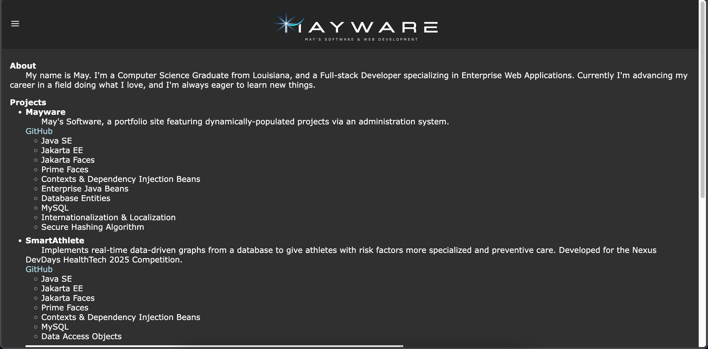
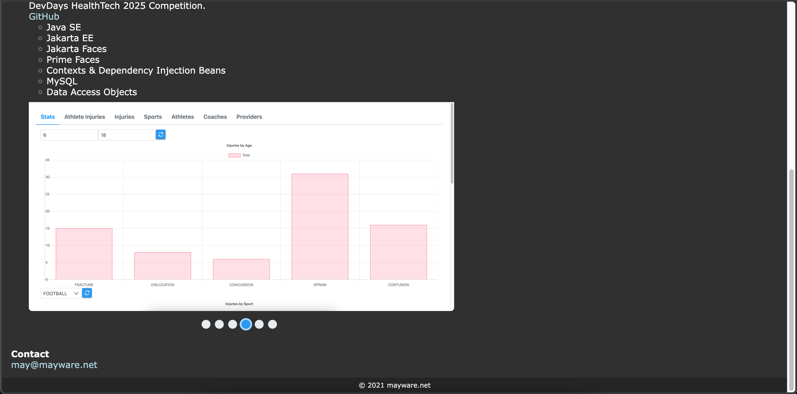
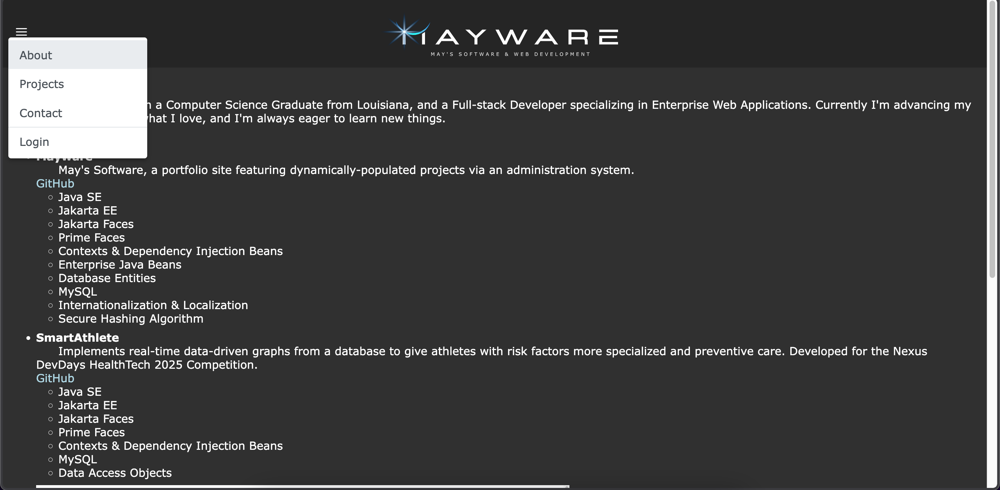
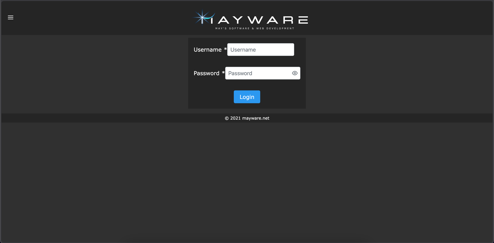
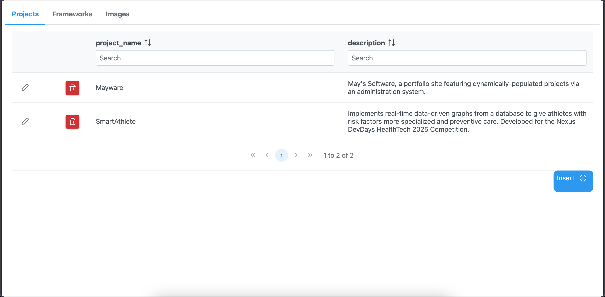
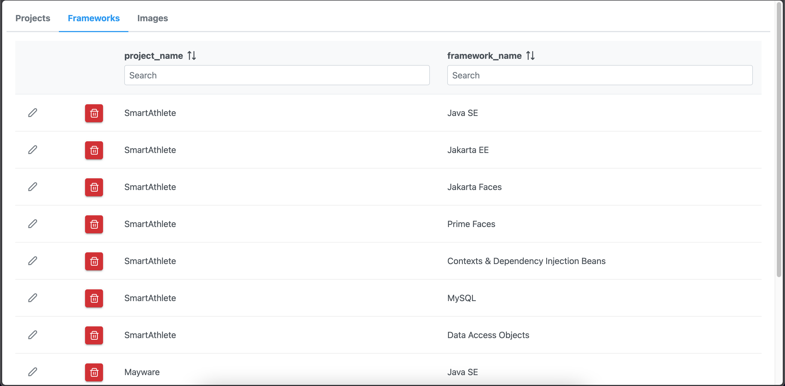
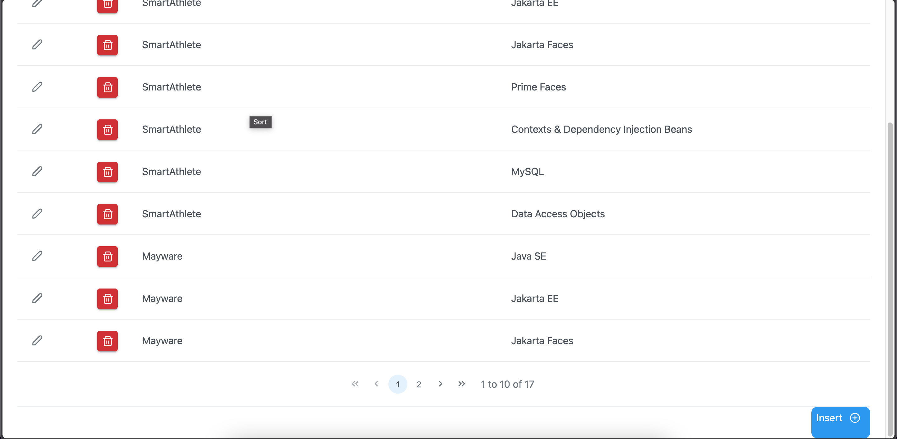
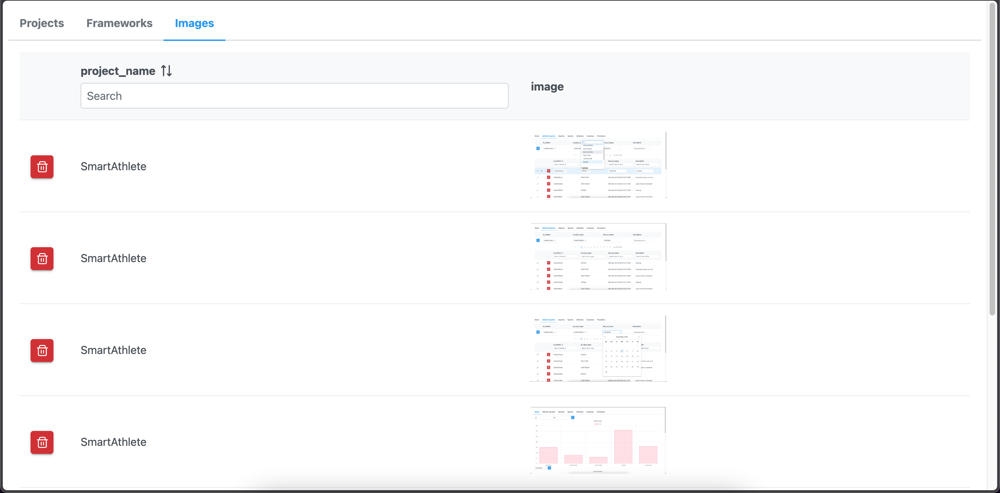
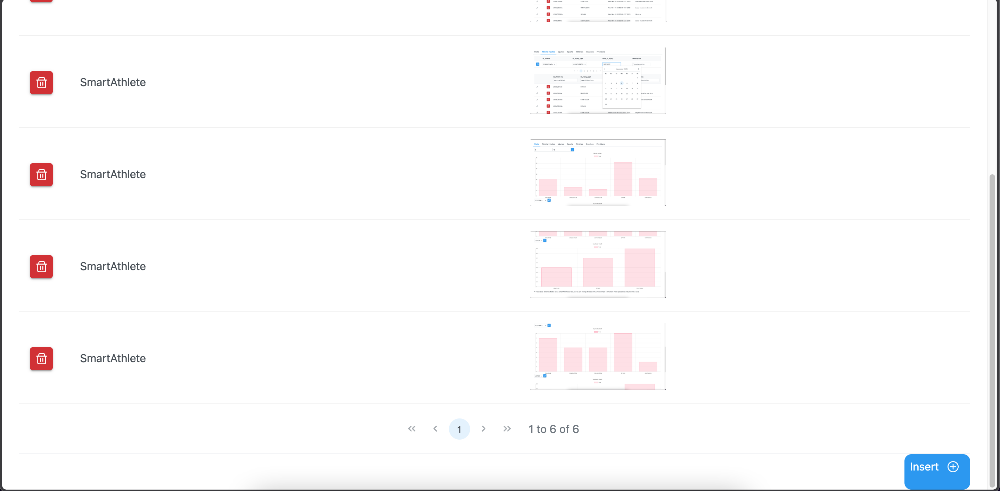

# About mayware
May's Software is a portfolio site featuring dynamically-populated projects via an administration system. Utilizes Jakarta EE, Jakarta Faces, Prime Faces, Pretty Faces, Enterprise Java Beans, CDI beans, Database Entities, MySQL, Internationalization & Localization, Secure Hashing Algorithm

